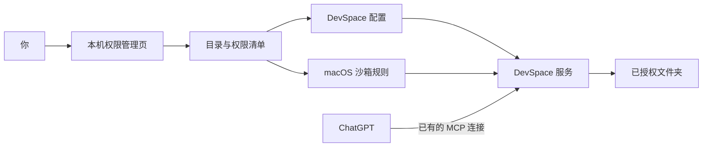

<p align="center">
  
</p>

# DevSpace 本机助手 · by Nar

> **DevSpace 让 ChatGPT 直接处理你电脑里的文件和项目。我在它的基础上加了一个管理页面，让选择文件夹、调整权限这些操作更方便。**

**原版 DevSpace：[Waishnav/devspace](https://github.com/Waishnav/devspace)**

**本项目：DevSpace 的 macOS 配套管理页面，由 [Nar / 那不然](https://github.com/Nar101) 制作。**

## 先说 DevSpace 解决了什么问题

只在网页里和 ChatGPT 聊天、还没有连接本机工具时，你通常要把资料复制或上传给它，拿到结果后再自己保存到电脑里。让它修改一个本地项目，还得来回搬文件、复制代码，或者自己打开终端执行命令。

[DevSpace](https://github.com/Waishnav/devspace) 把 ChatGPT 和你自己的电脑接起来。它运行在你的机器上，通过 MCP——一种让 AI 调用外部工具的协议——把获准的本地项目开放给 ChatGPT。

连接后，你可以继续在 ChatGPT 中提出任务，让它在授权范围内：

- 直接读取和搜索项目文件，了解已有内容；
- 创建、修改文件，把结果保存回原来的项目目录；
- 执行终端命令，运行脚本、测试或构建；
- 读取项目的 `AGENTS.md` 等说明，发现本地技能，按项目约定工作。

例如，你可以让它“看看这个项目里的需求文档，整理一份待确认问题”，也可以让它“修改这段代码，然后运行测试”。文件访问与执行能力由 **DevSpace** 提供，具体任务能否完成还取决于授权范围、模型和本机工具。

文件继续保存在你的电脑上；通过工具读取并返回的内容会进入 ChatGPT。它并不意味着数据完全不离开电脑。

## v0.3.2 更新

管理页现在把四件日常事情放到一起：查看连接并修复、管理文件夹授权、同步本地会话与活动历史、查看受限 CLI 接入。新增代码位于 `cli/`、`context/` 及服务管理模块。

- **连接恢复**：登录启动等待本机服务就绪，启动失败会重试；“修复连接”会补启缺失组件，保留用户主动暂停的同步设置。
- **上下文同步**：按需导出本地会话及活动历史的可检索副本，支持暂停、补同步和排除会话。原始会话与导出副本均不随源码发布。
- **CLI 接入**：通过参数规则、独立执行环境和请求记录调用已核对的命令；具体业务工具仍需要本机安装与登录。
- **安全修复**：管理会话改用页面专属令牌，避免其他本机端口取得 Cookie 后复用权限；排除会话时同步清理旧月份索引，清理过程拒绝跟随符号链接。

版本细节见 [更新记录](CHANGELOG.md)。目前仍是已有部署的源码预览，没有新增通用安装包。

## 最初为什么做这个管理页

用上 DevSpace 之后，我想让日常管理更简单：新项目换了一个目录，能不能点几下就开放给 ChatGPT？一份资料只想让它看，能不能直接选“只读”？不用了，能不能在同一个地方收回访问？

原版 DevSpace 已有初始化和配置流程。在我的 Mac 部署里，目录变化还需要同时处理服务配置和额外的系统沙箱规则。每次都去修改配置，操作起来不方便。

**所以我在现有 DevSpace 的基础上，加了这个本机文件夹权限管理页面。**

打开页面，就能看见已经授权的目录，添加文件夹，切换只读或读写，以及撤销访问。也可以从 Raycast 一键打开，不必再去找配置文件或启动命令。页面背后的配置更新和必要重启会自动处理。

| 部分 | 负责什么 |
| --- | --- |
| **原版 DevSpace** | 把 ChatGPT 连接到本机，提供工作区、文件读写、搜索和命令执行能力 |
| **我加的管理页面** | 让用户更方便地查看、添加和调整文件夹授权，管理 DevSpace 的本机访问范围 |

**这个仓库发布的是配套管理页面及其所需代码。** 如果你第一次接触 DevSpace，应先看[原项目的安装与接入说明](https://github.com/Waishnav/devspace#installation)。本仓库不会替代 DevSpace 本身。


*这里保留的是 v0.1.0 文件夹权限页截图；最新四页界面请运行下面的本地演示。截图不表示真实系统授权。*

## 先体验管理页面

当前版本是 **v0.3.2 源码预览**。页面已经在我的 Mac 上使用，但完整安装仍依赖已有的 DevSpace 部署，暂时不能在空白电脑上直接安装。

如果只想看看界面，安装 Node.js 24 后运行：

```sh
git clone https://github.com/Nar101/devspace-access-manager.git
cd devspace-access-manager
npm ci
npm run demo
```

打开 `http://127.0.0.1:7680`。演示可以体验添加、只读切换和撤销，只改变内存中的示例数据，不接触真实文件或系统权限。完整部署条件见[集成说明](docs/integration.md)。

## 用起来是什么样

### 1. 打开管理页

可以通过 Raycast 搜索“DevSpace 文件夹权限”，也可以双击启动文件。启动器会打开浏览器并建立短期管理会话。

管理页只在自己的 Mac 上开放。关闭网页后，DevSpace 仍可继续运行；管理后台空闲 15 分钟会自动退出，下次需要时再打开。

### 2. 选一个工作文件夹

点击“添加文件夹”，在系统目录选择窗口中选中目录，再确认访问权限。

| 权限 | ChatGPT 可以做什么 |
| --- | --- |
| 读写 | 在授权范围内读取、创建、修改和删除业务文件 |
| 只读 | 查看资料，不能通过文件工具或命令修改内容 |


权限包括全部子目录。已经被父目录覆盖的文件夹会提示继承关系；添加更上层的目录时，确认区会列出将合并的子目录授权，以及统一后的权限。

账户凭据、管理配置等固定保护仍然存在，不会因为选了“读写”就全部解除。

### 3. 修改或撤销

点击目录旁的权限按钮可以切换只读与读写。撤销只取消访问，不删除原文件。

有任务在运行时，默认等它结束再应用。你也可以取消等待，或者明确选择“中断并应用”。后台确认旧服务和跟踪的执行进程组退出后，才加载新权限。

如果启动失败，管理器会尝试恢复上一有效配置。恢复仍失败时尝试停止服务并保留恢复记录；无法确认旧进程退出时，会报告失败，不会显示“撤销成功”。

## 管理页面背后怎样处理权限

ChatGPT 可以查询已经授权的目录，但不能通过 MCP 给自己增加目录权限。授权变化由用户在本机网页发起。



管理后台与公开 MCP 服务分开运行。管理页校验本机地址、请求来源和管理会话，拒绝跨站请求和页面嵌入。DevSpace 的命令不能修改管理器代码、配置或读取管理会话凭据。

系统隐私权限或文件系统权限不足时，页面会报告原因；不会以开启整盘访问作为默认解决方式。

## 安装与复用条件

**当前没有面向普通用户的通用安装命令。请不要把 `npm run install:local` 当成从零安装入口。**

完整管理功能复用了一套已有部署中的 Node、Express、启动脚本、LaunchAgent、沙箱基线与 OAuth 配置。一次性迁移器会检查这些文件的格式和哈希，再导入现有目录；它不是为任意 DevSpace 安装设计的插件安装器。

| 项目 | 当前范围 |
| --- | --- |
| 系统 | macOS；已在一台 Apple Silicon Mac 上运行 |
| DevSpace | 固定适配 1.0.8 |
| 运行库 | 当前部署使用独立 Node 24.20.0 |
| 目录选择 | Swift + AppKit，需要本机编译助手 |
| 启动入口 | Raycast 可选，也提供双击启动文件 |
| 其他系统 | 尚无 Windows 或 Linux 安装路径 |

如果你想参考这套实现，建议从 `src/policy.mjs`、`src/transactions.mjs` 和 `runtime/access-hook.mjs` 开始。真正迁移到另一台机器前，需要补齐自己的部署基线，并验证安装、只读限制、撤销和恢复流程。

新增的目录查询工具需要在 ChatGPT 中刷新一次工具列表。此后增加文件夹只更新返回数据，不需要为每个目录重新创建连接或重新登录。

## 已经验证了什么

公开版 v0.3.2 的本机验证包括 31 项 Node 测试和 13 项 Python 测试，覆盖权限事务、管理会话隔离、CLI 参数与执行限制、启动恢复、同步过滤及符号链接清理保护。macOS 测试包含真实 Seatbelt 检查；其他系统会跳过相关检查。

开发用 Mac 已运行此版本，并实测页面修复连接后恢复正常。90 秒启动等待与失败重试通过模拟延迟及状态测试验证，尚未通过本次整机重启验证。早期 18 项真实 MCP 联调记录只对应其当时覆盖范围，不等于新版全部功能均已做跨机器验收。

公开演示只使用示例数据。自动测试通过不代表另一台 Mac 已完成安装，也不代表所有第三方 CLI 的业务写入均已验收。

## 已知边界

- 这是单用户本机工具，不是虚拟机，也不是企业多用户权限平台。
- 授权读写意味着文件可以被修改或删除，重要资料仍需要备份。
- 文件留在本机存储；通过工具读取并返回的内容会进入所连接的 AI 客户端。
- 进程跟踪覆盖 DevSpace 创建的进程组，不承诺控制恶意程序独立脱离进程组的所有情况。
- 系统沙箱基于 `sandbox-exec`，系统和依赖升级后需要重新核验。
- 休眠、断网、关机会影响连接；目前没有长期稳定性或全平台兼容承诺。

## 源码结构

```text
public/                    管理网页
native/FolderPicker.swift  系统目录选择助手
src/policy.mjs             目录规则与沙箱生成
src/store.mjs              版本清单、哈希校验与操作锁
src/transactions.mjs       权限切换、失败恢复
src/supervisor.mjs         服务与执行进程管理
src/server.mjs             本机接口与短期会话
src/launch.mjs             按需启动入口
src/install.mjs            当前部署的一次性迁移器
runtime/                   DevSpace 集成
raycast/                   启动命令与图标
test/                      自动化与真实联调脚本
```

## 作者

我是 [Nar / 那不然](https://nar101.com)，持续实践 AI 时代个人与团队的工作方式。

这次实践从使用 DevSpace 开始。我补上一个方便操作的管理页面，让原有的本机文件与执行能力更容易进入日常使用。感谢 [Waishnav 和 DevSpace 贡献者](https://github.com/Waishnav/devspace) 提供基础项目。

## License

本项目采用 [MIT License](LICENSE)。上游来源与适配说明见 [NOTICE](NOTICE)。
