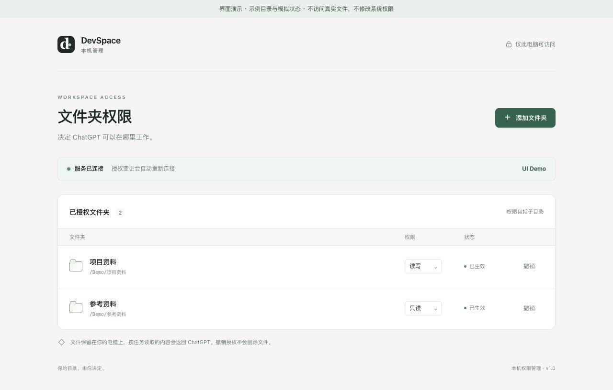
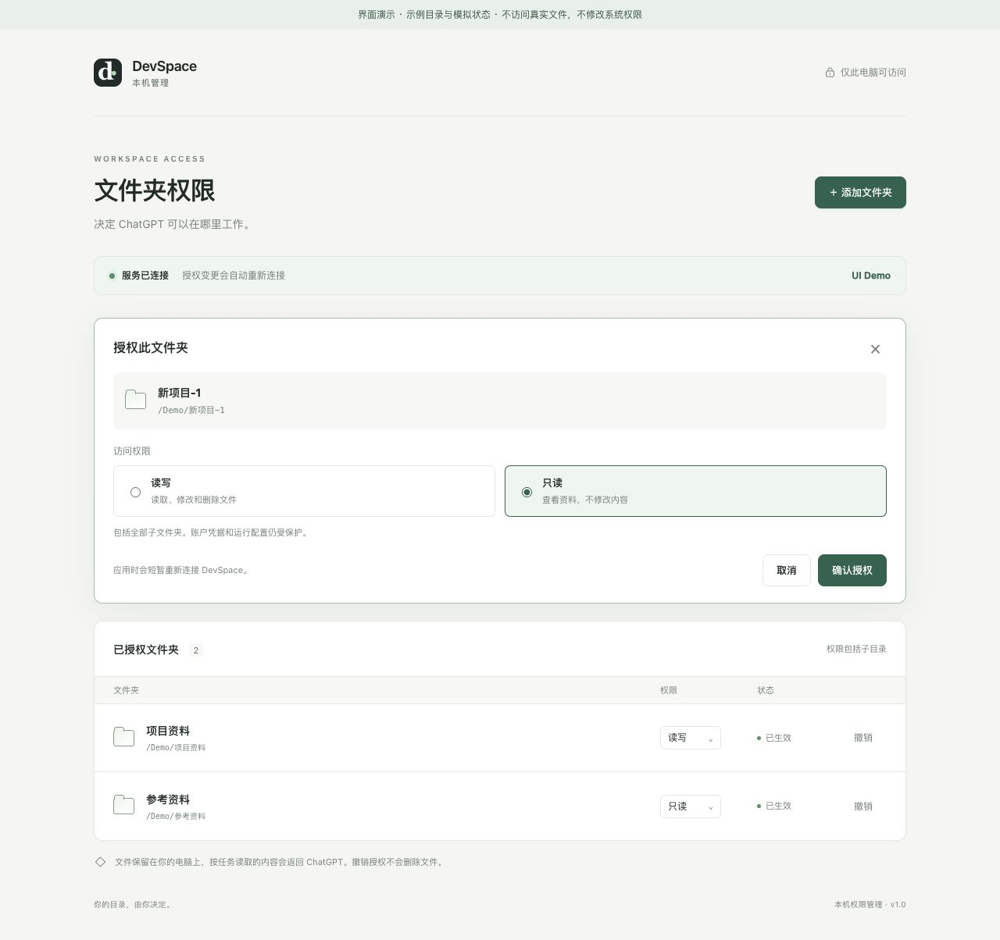
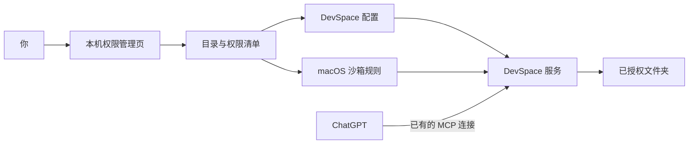

<p align="center">
  
</p>

# DevSpace 文件夹权限 · by Nar

> 给 DevSpace 加一个本机管理页，决定 ChatGPT 可以访问哪些文件夹，以及能不能修改其中的文件。

你在网页里选择目录，默认允许读写，也可以切成只读。需要收回访问时，点击撤销即可。后台负责更新配置、处理正在执行的任务、重新连接服务，并核对新权限是否生效。

这个工具来自一个真实需求：我已经让 ChatGPT 通过 DevSpace 处理 Mac 上的文件，但每次增加工作目录，都要手动修改服务配置和系统沙箱规则。我想把这件事变成一个随时能打开、看得清楚、自己能控制的界面。

**作者：[Nar / 那不然](https://github.com/Nar101)** · [GitHub](https://github.com/Nar101/devspace-access-manager) · [个人网站](https://nar101.com)

**当前阶段：v0.1.0 源码预览，本机已运行。** 仓库中的安装器依赖一套已有的 macOS DevSpace 部署，尚不支持在空白电脑上直接安装。下面会明确说明已实现的功能、已测范围和复用条件。



*截图来自实际前端的隔离演示：目录与状态为示例，不表示真实系统授权。*

## 先看看界面

安装 Node.js 24 后，可以运行不接触真实文件的界面演示：

```sh
git clone https://github.com/Nar101/devspace-access-manager.git
cd devspace-access-manager
npm ci
npm run demo
```

打开 `http://127.0.0.1:7680`。演示使用内存数据，可以体验添加、只读切换和撤销；完整部署条件见 [集成说明](docs/integration.md)。

## 它解决什么问题

当 AI 开始直接处理电脑里的资料，目录访问会变成一件需要经常管理的事：

- 新项目放在另一个文件夹里，怎么让 ChatGPT 访问？
- 有些资料只想让它看，不希望它修改，怎么设置？
- 一个项目结束后，怎么收回访问，同时保留原文件？
- 命令还在运行，这时改权限会发生什么？
- 配置已经保存，怎么知道运行中的服务真的用了新权限？

DevSpace 文件夹权限把这些操作放在同一页。日常使用时，不需要再手工维护目录清单和沙箱规则。

## 用起来是什么样

### 1. 打开管理页

可以通过 Raycast 搜索“DevSpace 文件夹权限”，也可以双击启动文件。启动器会打开浏览器并建立短期管理会话。

管理页只在自己的 Mac 上开放。关闭网页后，DevSpace 仍可继续运行；管理后台空闲 15 分钟会自动退出，下次需要时再打开。

### 2. 选一个工作文件夹

点击“添加文件夹”，在系统目录选择窗口中选中目录，再确认访问权限。

| 权限 | ChatGPT 可以做什么 |
| --- | --- |
| 读写 | 在授权范围内读取、创建、修改和删除业务文件 |
| 只读 | 查看资料，不能通过文件工具或命令修改内容 |



权限包括全部子目录。已经被父目录覆盖的文件夹会提示继承关系；添加更上层的目录时，确认区会列出将合并的子目录授权，以及统一后的权限。

账户凭据、管理配置等固定保护仍然存在，不会因为选了“读写”就全部解除。

### 3. 修改或撤销

点击目录旁的权限按钮可以切换只读与读写。撤销只取消访问，不删除原文件。

有任务在运行时，默认等它结束再应用。你也可以取消等待，或者明确选择“中断并应用”。后台确认旧服务和跟踪的执行进程组退出后，才加载新权限。

如果启动失败，管理器会尝试恢复上一有效配置。恢复仍失败时尝试停止服务并保留恢复记录；无法确认旧进程退出时，会报告失败，不会显示“撤销成功”。

## 它和 DevSpace 是什么关系

[DevSpace](https://github.com/Waishnav/devspace) 是上游项目，负责通过 MCP 向 ChatGPT 等客户端提供本机工作区、文件和命令能力。

本项目是面向 macOS 的配套权限管理层，由 Nar 设计并组织 AI 开发，主要增加：

- 本机文件夹管理网页和系统目录选择助手；
- 统一的目录授权清单，以及配置和沙箱规则生成；
- 权限切换时的等待、中断、版本核对与恢复；
- 只读 MCP 工具 `list_authorized_folders`，让客户端查询当前授权范围；
- Raycast 和双击启动入口。

上游的文件操作、命令执行和 MCP 基础能力不属于本项目原创。当前集成针对 DevSpace 1.0.8，升级上游版本时需要重新核验适配。

## 为什么管理入口留在本机

ChatGPT 可以查询已经授权的目录，但不能通过 MCP 给自己增加目录权限。授权变化由用户在本机网页发起。



管理后台与公开 MCP 服务分开运行。管理页校验本机地址、请求来源和管理会话，拒绝跨站请求和页面嵌入。DevSpace 的命令不能修改管理器代码、配置或读取管理会话凭据。

系统隐私权限或文件系统权限不足时，页面会报告原因；不会以开启整盘访问作为默认解决方式。

## 安装与复用条件

**当前没有面向普通用户的通用安装命令。请不要把 `npm run install:local` 当成从零安装入口。**

完整管理功能复用了一套已有部署中的 Node、Express、启动脚本、LaunchAgent、沙箱基线与 OAuth 配置。一次性迁移器会检查这些文件的格式和哈希，再导入现有目录；它不是为任意 DevSpace 安装设计的插件安装器。

| 项目 | 当前范围 |
| --- | --- |
| 系统 | macOS；已在一台 Apple Silicon Mac 上运行 |
| DevSpace | 固定适配 1.0.8 |
| 运行库 | 当前部署使用独立 Node 24.20.0 |
| 目录选择 | Swift + AppKit，需要本机编译助手 |
| 启动入口 | Raycast 可选，也提供双击启动文件 |
| 其他系统 | 尚无 Windows 或 Linux 安装路径 |

如果你想参考这套实现，建议从 `src/policy.mjs`、`src/transactions.mjs` 和 `runtime/access-hook.mjs` 开始。真正迁移到另一台机器前，需要补齐自己的部署基线，并验证安装、只读限制、撤销和恢复流程。

新增的目录查询工具需要在 ChatGPT 中刷新一次工具列表。此后增加文件夹只更新返回数据，不需要为每个目录重新创建连接或重新登录。

## 已经验证了什么

2026 年 9 月的本机开发记录包含两组验证：

| 验证 | 结果及覆盖范围 |
| --- | --- |
| 11 项自动化测试 | 会话与请求校验、空闲退出、目录合并、空授权清单、配置篡改、并发锁、失败回滚和事务恢复；包括真实 Seatbelt 的只读、符号链接及硬链接限制 |
| 18 项真实 MCP 联调 | 外部目录授权、中文/空格/引号路径、文件与命令读写、只读拒写、等待与取消、中断后撤销、旧工作区访问被拒绝、管理接口与凭据隔离 |

这些结果来自开发用 Mac，不能代替其他机器的安装验收。测试使用临时目录，完成后清理测试目录与令牌，保留原有业务目录授权。

网页外观、修改权限确认与取消、原生目录助手启动与取消已检查。公开演示的桌面、窄屏和添加/只读/撤销交互已检查。真实系统弹窗中实际选择目录、深色视觉，以及 ChatGPT 设置页的一次工具刷新，仍有未完成的验收项。

## 已知边界

- 这是单用户本机工具，不是虚拟机，也不是企业多用户权限平台。
- 授权读写意味着文件可以被修改或删除，重要资料仍需要备份。
- 文件留在本机存储；通过工具读取并返回的内容会进入所连接的 AI 客户端。
- 进程跟踪覆盖 DevSpace 创建的进程组，不承诺控制恶意程序独立脱离进程组的所有情况。
- 系统沙箱基于 `sandbox-exec`，系统和依赖升级后需要重新核验。
- 休眠、断网、关机会影响连接；目前没有长期稳定性或全平台兼容承诺。

## 源码结构

```text
public/                    管理网页
native/FolderPicker.swift  系统目录选择助手
src/policy.mjs             目录规则与沙箱生成
src/store.mjs              版本清单、哈希校验与操作锁
src/transactions.mjs       权限切换、失败恢复
src/supervisor.mjs         服务与执行进程管理
src/server.mjs             本机接口与短期会话
src/launch.mjs             按需启动入口
src/install.mjs            当前部署的一次性迁移器
runtime/                   DevSpace 集成
raycast/                   启动命令与图标
test/                      自动化与真实联调脚本
```

## 作者

我是 [Nar / 那不然](https://nar101.com)，持续实践 AI 时代个人与团队的工作方式。

这个工具是其中一个小的实践：让 AI 能进入真实工作目录，同时让人看得见它的访问范围，并且能够调整和收回。

## License

本项目采用 [MIT License](LICENSE)。上游来源与适配说明见 [NOTICE](NOTICE)。
